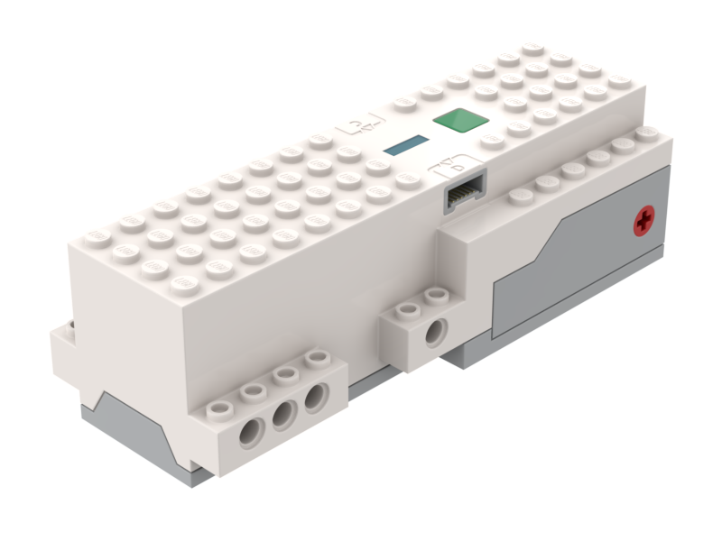
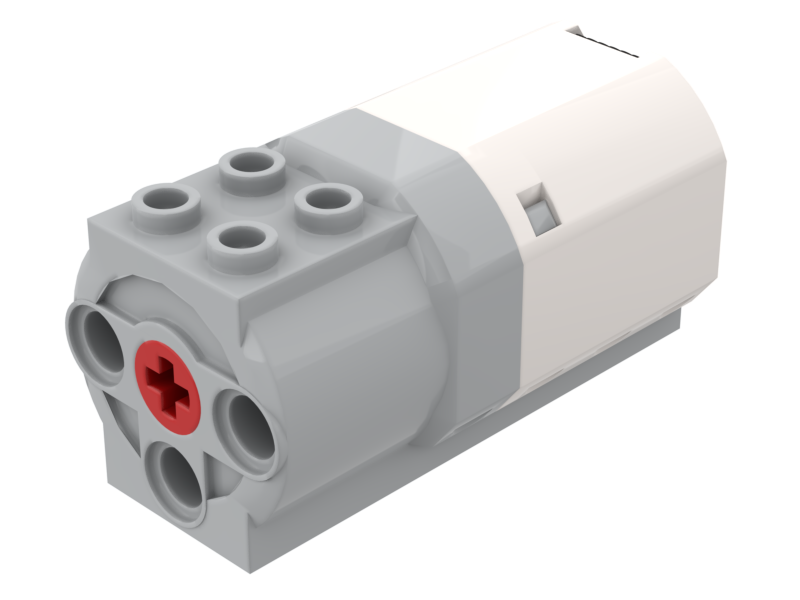
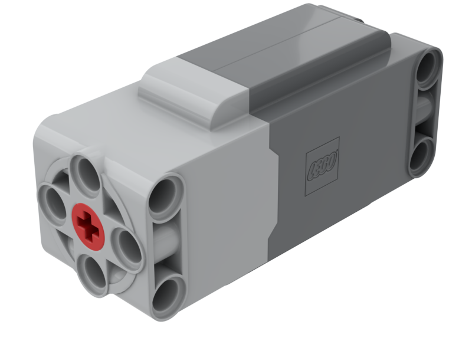
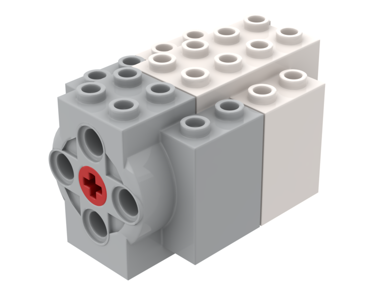

.. |technic_hub| image:: technic_hub.png
	:height: 40
	:alt: Control+
	
.. |technic_hub_large| image:: technic_hub.png
	:height: 250
	:alt: Remote
	
.. |remote| image:: _images/remote.png
	:height: 40
	:alt: Control+
	
.. |remote_large| image:: _images/remote.png
	:height: 250
	:alt: Control+
	

	
.. |city| image:: _images/city_hub.png
	:height: 40
	:alt: City hub
	
.. |remote| image:: _images/remote.png
	:height: 40
	:alt: Remote
	
.. |WeDo_distance| image:: _images/WeDo_distance.png
	:height: 60
	:alt: WeDo distance sensor
	
.. |WeDo_tilt| image:: _images/WeDo_tilt.png
	:height: 60
	:alt: WeDo tilt sensor
	
.. |Boost_sensor| image:: _images/boost_sensor.png
	:height: 60
	:alt: Boost sensor
	
.. |color_sensor| image:: _images/color_sensor.png
	:height: 60
	:alt: Color sensor
	
.. |ultrasonic_sensor| image:: _images/ultrasonic_sensor.png
	:height: 60
	:alt: Ultrasonic sensor
	
.. |force_sensor| image:: _images/force_sensor.png
	:height: 60
	:alt: Force sensor
	

	

	
.. |technic_XL_motor| image:: _images/technic_XL_motor.png
	:height: 100
	:alt: Technic XL motor
	

	
.. |spike_angular_XL| image:: _images/spike_angular_XL.png
	:height: 100
	:alt: Spike angular XL motor
	
.. |spike_angular_L| image:: _images/spike_angular_L.png
	:height: 100
	:alt: Spike angular L motor
	
.. |RI_angular_L| image:: _images/inventor_angular_L.png
	:height: 100
	:alt: Robot inventor angular L